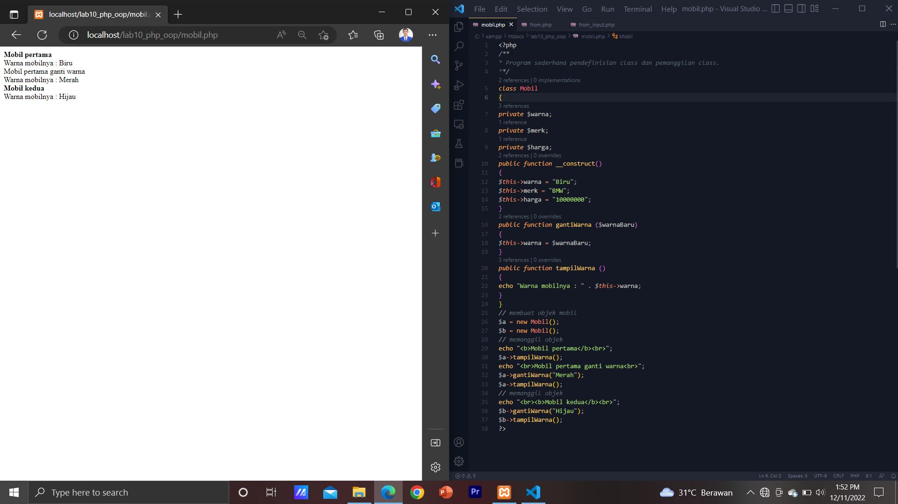
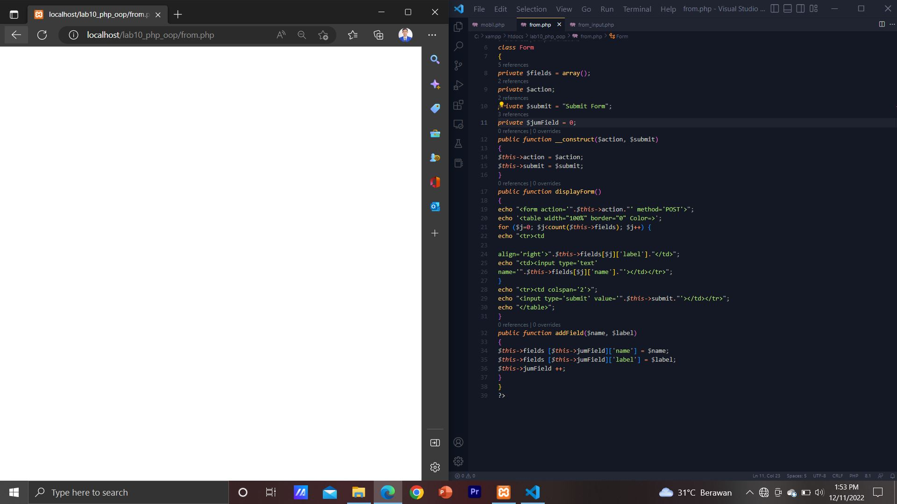
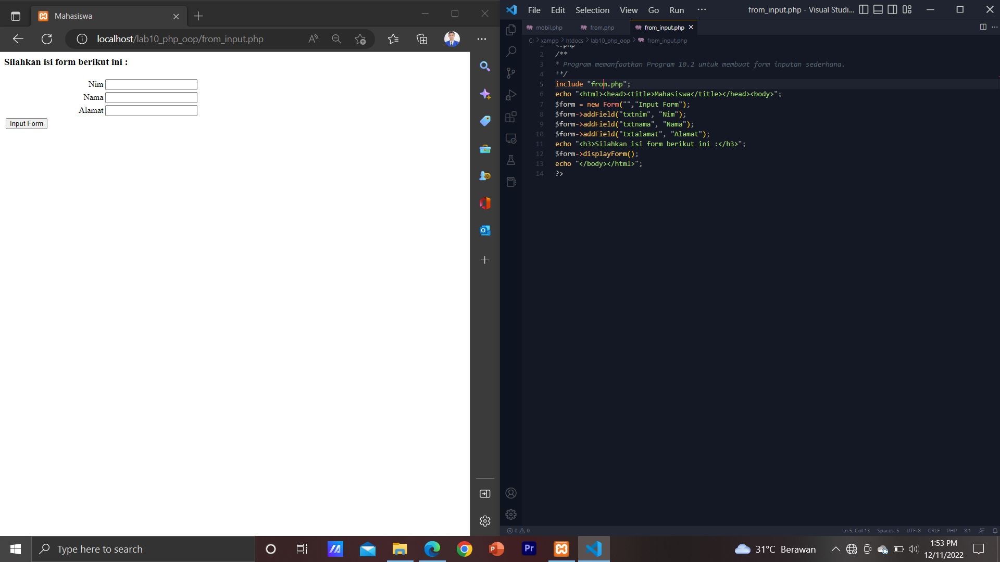

# Lab10web
# Praktikum 10 
# PHP Object Orientied Programing

* Menampilkan daftar mobil sesuai dengan class yang di buat
     * berikut adalah hasilnya:
     * 

* Membuat kerangka Form , kerangka ini dapat digunakan dan dimodifikasi sesuai kebutuhan,
     * berikut adalah hasilnya:
     * 

* Menampilkan Form Inputan yang Terhubung dengan Form di atas
     * Berikut adalah hasilnya
     * 
     